# Robotcontrol editor toolbox - Blender addon.

*Robotcontrol editor toolbox* es un conjunto de herramientas creado para diseñar escenarios en 3D y controlar de forma remota plataformas robóticas. Es compatible para versiones superiores a 2.8 de *Blender*.

  

    
    

## Instalación.

En el último *release* se encuentra el código preparado para ser instalado.

### 1. Activar *addon Measureit*.

Para activar *Measureit* nos dirigimos a la pestaña preferencias : **Edit > Preferences**. Posteriormente, en la pestaña *add-ons*, buscamos *Measureit* y comprobamos que el *checklist* esté seleccionado.

  

  

    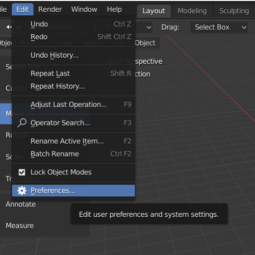
  

  

    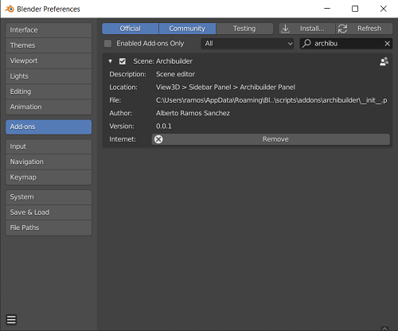
  

  

### 2. Instalar *msgpack*.

**Msgpack** es un módulo de *Python* encargado de comprimir los paquetes utilizados en la comunicación con las plataformas robóticas.

Para instalarlo, seguimos los siguientes pasos:

1. Nos dirigimos a la carpeta donde tenemos instalado *Blender*.
2. Abrimos una terminal en **ruta-instalación-blender/blender-2.82a-windows64/blender-2.82a-windows64/2.82/python/bin/**.
3. Ejecutamos los siguientes comandos:
  1. **./python.exe -m pip install --upgrade pip**
  2. **./python.exe -m pip install msgpack**

### Instalar *addons*.

Al no estar distribuidos con la propia aplicación *Blender*, debemos instalarlos a partir de los 4 ficheros comprimidos en zip que se encuentran en zip del último *release* (*archibuilder.zip*, *robotcontrol.zip*, *utilities.zip* y *filemanager.zip*).

La instalación se realiza desde el panel de *Addons* de la ventana de preferencias.

Clicando en *Install...*, seleccionamos el fichero *zip* que deseamos instalar. Una vez instalado, nos debería aparecer automáticamente en el término de búsqueda. Si no es así, lo buscamos y lo activamos, al igual que lo hicimos con *Measureit*.

Estos pasos los repetimos con los 4 ficheros *zip* que disponemos.

Una vez completados estos pasos, guardamos las preferencias en la opción *Save preferences*.

## Funciones.

### Diseño de escenarios.

Con el addon *archibuilder*, se pueden crear paredes, habitaciones, techos y posicionar emisores de señales (*beacons*).
 
 

##### Crear paredes.

  

    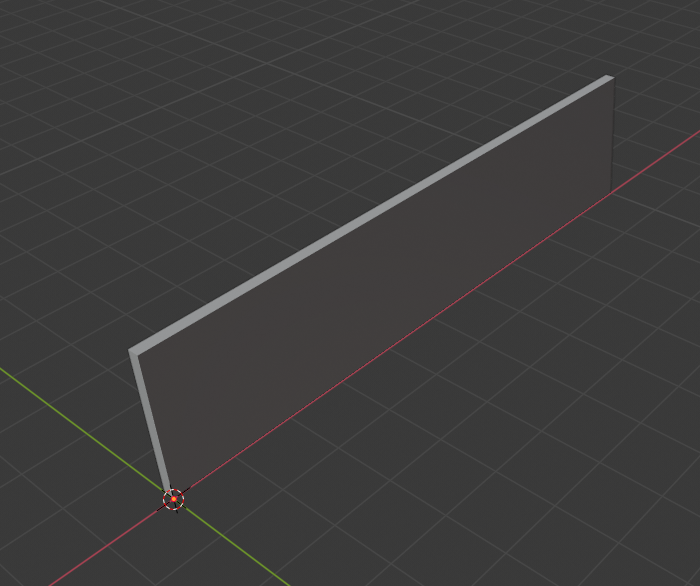
  

  

    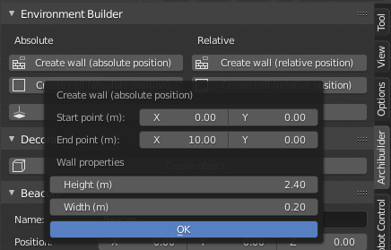
  

 
 

##### Crear habitaciones.

  

    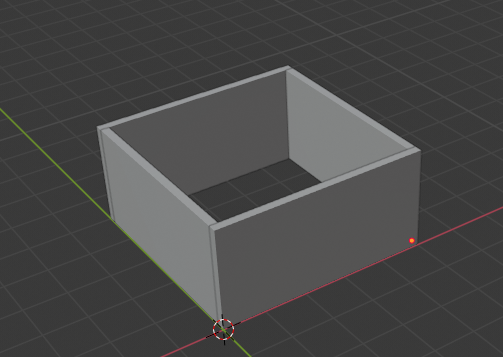
  

  

    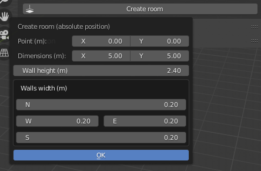
  

 
 

##### Crear techos.

  

    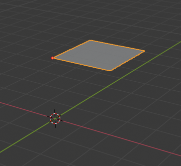
  

  

    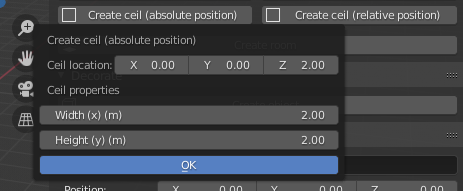
  

 
 

##### Crear obstáculos.

  

    
  

  

    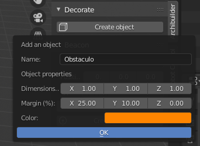
  

 
 

##### Posicionar *beacons*.

  

    
  

  

    
  

 
 

##### Exportar escenarios.

### Control de plataformas robóticas.

Con el *addon robotcontrol* se pueden crear plataformas robóticas virtuales, con los que diseñar y ejecutar planes de navegación sobre un escenario.
 
 

#### Creación de plataformas robóticas.

  

  

    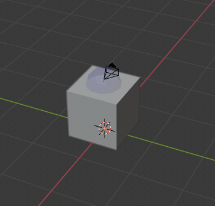
  

  

    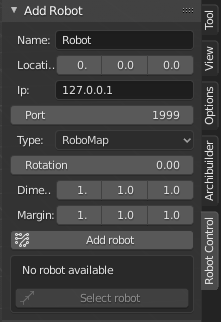
  

  

#### Diseño de planes de navegación.

  

    
    

#### Ejecución de rutas.

Se pueden enviar rutas, pausar la plataforma, controlar su velocidad y cancelar planes de navegación.

  

    
    

#### Simulación.

Sin necesidad de comunicarse con la plataforma se pueden simular planes de navegación creados, con controles similares al panel de control de la plataforma.

  

    
    

