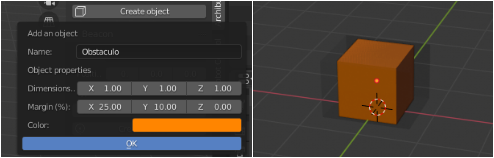

# Robotcontrol editor toolbox - Blender addon.

*Robotcontrol editor toolbox* es un conjunto de herramientas creado para diseñar escenarios en 3D y controlar de forma remota plataformas robóticas. Es compatible para versiones superiores a 2.8 de *Blender*.

  

Figura 1: Simulación.

## Instalación.

En el último *release* se encuentra el código preparado para ser instalado.

### 1. Activar *addon Measureit*.

Para activar *Measureit* nos dirigimos a la pestaña preferencias : **Edit > Preferences**. Posteriormente, en la pestaña *add-ons*, buscamos *Measureit* y comprobamos que el *checklist* esté seleccionado.

### 2. Instalar *msgpack*.

**Msgpack** es un módulo de *Python* encargado de comprimir los paquetes utilizados en la comunicación con las plataformas robóticas.

Para instalarlo, seguimos los siguientes pasos:

1. Nos dirigimos a la carpeta donde tenemos instalado *Blender*.
2. Abrimos una terminal en **ruta-instalación-blender/blender-2.82a-windows64/blender-2.82a-windows64/2.82/python/bin/**.
3. Ejecutamos los siguientes comandos:
  1. **./python.exe -m pip install --upgrade pip**
  2. **./python.exe -m pip install msgpack**

### 3. Instalar *addons*.

Este *toolbox* debemos instalarlo a partir de los 4 ficheros comprimidos en zip que se encuentran dentro del archivo zip del último *release* (*archibuilder.zip*, *robotcontrol.zip*, *utilities.zip* y *filemanager.zip*).

La instalación se realiza desde el panel de *Addons* de la ventana de preferencias.

Clicando en *Install...*, seleccionamos el fichero *zip* que deseamos instalar. Una vez instalado, nos debería aparecer automáticamente en el término de búsqueda. Si no es así, lo buscamos y lo activamos, al igual que lo hicimos con *Measureit*.

Estos pasos los repetimos con los 4 ficheros *zip* que disponemos.

Una vez completados estos pasos, guardamos las preferencias en la opción *Save preferences*.

## Funciones.

### Diseño de escenarios.

Con el addon *archibuilder*, se pueden crear paredes, habitaciones, techos y posicionar emisores de señales (*beacons*).
 
 

#### Crear paredes.

Se pueden crear paredes con las que delimitar un escenario virtual.

#### Crear habitaciones.

Utilizando paredes, se facilita la creación de habitaciones, que pueden modificarse.

#### Crear techos.

Los techos se representan como planos semitransparentes. Pueden situarse sobre el escenario, para delimitar su altura.

#### Crear obstáculos.

Los obstáculos representan zonas en las que las plataformas robóticas no pueden adentrarse.

#### Posicionar *beacons*.

Los *beacons* son emisores de señales que utiliza la plataforma robótica para orientarse en el escenario real. En el escenario virtual son utilizados como información adicional al usuario, para conocer donde están situados en la realidad.

 
 

#### Exportar escenarios.

Los escenarios diseñados pueden exportarse a ficheros ***.blend***.

### Control de plataformas robóticas.

Con el *addon robotcontrol* se pueden crear plataformas robóticas virtuales, con los que diseñar y ejecutar planes de navegación sobre un escenario.
 
 

#### Creación de plataformas robóticas.

El *addon* está adaptado para poder diseñar múltiples tipos de plataformas robóticas. Por el momento, solamente se encuentra implementado el diseño de *RoboMap*.

#### Diseño de planes de navegación.

Siempre que exista una plataforma robótica en el escenario virtual, pueden crearse planes de navegación, que pueden ser enviados a la plataforma real para que los ejecute, o simularlos en la propia aplicación.

  

#### Ejecución de rutas.

Se pueden enviar rutas, pausar la plataforma, controlar su velocidad y cancelar planes de navegación.

  

#### Simulación.

Sin necesidad de comunicarse con la plataforma se pueden simular planes de navegación creados, con controles similares al panel de control de la plataforma.

  

